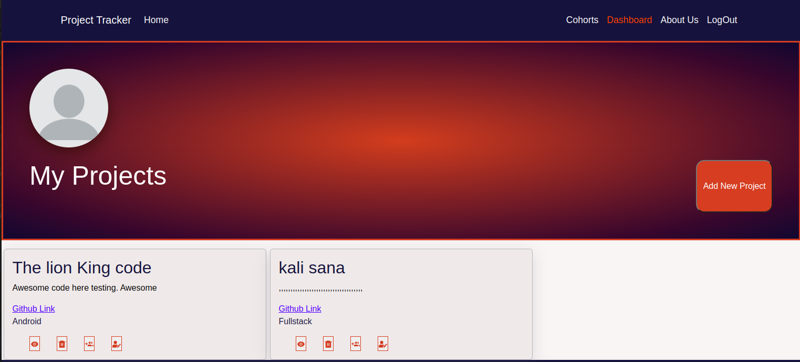

# Project Tracker

Project Tracker is a web based system that keeps tracks of students' projects thus creating a secure project bank for future reference.

Through the platform students can create an association kind of network where they can collaborate in projects and also seek for ideas from amongst themselves.

We invite you to  watch a live demo we've posted on [Youtube](https://youtu.be/LUx2aZwh64I).

### By Group 11, 04/11/2022

## Landing Page

## Signup Page

## Login Page

## Cohorts Page

## Students Dashboard Page

Demo on youtube

Watch on [Youtube Video](https://youtu.be/LUx2aZwh64I2)

## Table of Content

- [Project Tracker](#project-tracker)
    - [By Group 11, 04/11/2022](#by-group-11-04112022)
  - [Landing Page](#landing-page)
  - [Signup Page](#signup-page)
  - [Login Page](#login-page)
  - [Live Demo on Youtube](#live-demo-on-youtube)
  - [Table of Content](#table-of-content)
  - [Description](#description)
  - [Features](#features)
    - [Requirements](#requirements)
    - [Installation Process](#installation-process)
    - [Live Link](#live-link)
    - [Technology  Used](#technology--used)
  - [Known Bugs](#known-bugs)
  - [Licence](#licence)

## Description

****
Project Tracker is a web based application which allows Administrators, in this case Technical Mentors create classes called cohorts.

An Administrator can:

- Create a cohort and add students to the cohort.
- Delete a cohort.
- Add and delete a project.

Each student who signs up to the platform is pre-assigned a cohort.

Students can add a project in the his dashboard panel which automatically appears in the cohort he or she belongs to.

The project can either be a Full Stack project or an Android project.

The student can:

- Delete the project
- Update the project details
- Add Members to a project for collaboration purposes
- A student can send an email request to a fellow student within the same cohort to seek clarity or collaboration, whichever aim for communication is.

***

[Go Back to the top](#project-tracker)

## Features

As an Admin you should be able to:

1. `Create a cohort` 
2. `Add students` to the cohort
3. `Update` the cohort created
4. `Delete` the cohort

As Student you should be able to:

1. `Register`  a student account
2. `View` all cohorts
3. `View` other students projects in the availble cohorts
4. `Contact` other students requesting for collaboration and pass other relevant information through email.
5. `Create` projects
6. `Update and Delete` the projects
7. `Add member students` to a project for collaboration

[Go Back to the top](#project-tracker)

### Requirements

- Access to  a computer, mobile phone or any other garget
- Internet access

### Installation Process

****

- Clone to this repo by running the command : `git@github.com:ChadGichuki/project-tracker-frontend.git`
- Unzip the downloaded files in a folder of choice.
- Open the folder with your favorite CLI tool.
- Run `npm install` on your terminal from inside the root folder of the project
- Run `npm start or yarn start` depending  on your package manager installation in your terminal from inside the root folder of the project to run the server
- The server should run on `http://localhost:3000` by default
- If the port is busy, you can follow the prompt instruction in your terminal.
- Once the server is up and running, visit the link  `http://localhost:3000` to access the application
- You can also check out the app's API at [Project Tracker API](https://github.com/Thecodingobare/project_tracker)
  
 ****
[Go Back to the top](#project-tracker)

### Live Link

- [Project tracker live link](http://project-tracker-frontend-nine.vercel.app/)
  
****

### Technology  Used

- REACT JS -to develop the structure of the page and build component based UI
- BOOTSTRAP AND VANILLA CSS - to style the User Interface
- RUBY (Rails) - To build a RESTful API

  

[Go Back to the top](#project-tracker)

****

## Known Bugs

- N/A

****

## Licence

MIT License
Copyright (c) [2022] [Group 11]
Permission is hereby granted, free of charge, to any person obtaining a copy
of this software and associated documentation files (the "Software"), to deal
in the Software without restriction, including without limitation the rights
to use, copy, modify, merge, publish, distribute, sublicense, and/or sell
copies of the Software, and to permit persons to whom the Software is
furnished to do so, subject to the following conditions:
The above copyright notice and this permission notice shall be included in all
copies or substantial portions of the Software.
THE SOFTWARE IS PROVIDED "AS IS", WITHOUT WARRANTY OF ANY KIND, EXPRESS OR
IMPLIED, INCLUDING BUT NOT LIMITED TO THE WARRANTIES OF MERCHANTABILITY,
FITNESS FOR A PARTICULAR PURPOSE AND NONINFRINGEMENT. IN NO EVENT SHALL THE
AUTHORS OR COPYRIGHT HOLDERS BE LIABLE FOR ANY CLAIM, DAMAGES OR OTHER
LIABILITY, WHETHER IN AN ACTION OF CONTRACT, TORT OR OTHERWISE, ARISING FROM,
OUT OF OR IN CONNECTION WITH THE SOFTWARE OR THE USE OR OTHER DEALINGS IN THE
SOFTWARE.

[Go Back to the top](#project-tracker)
****

